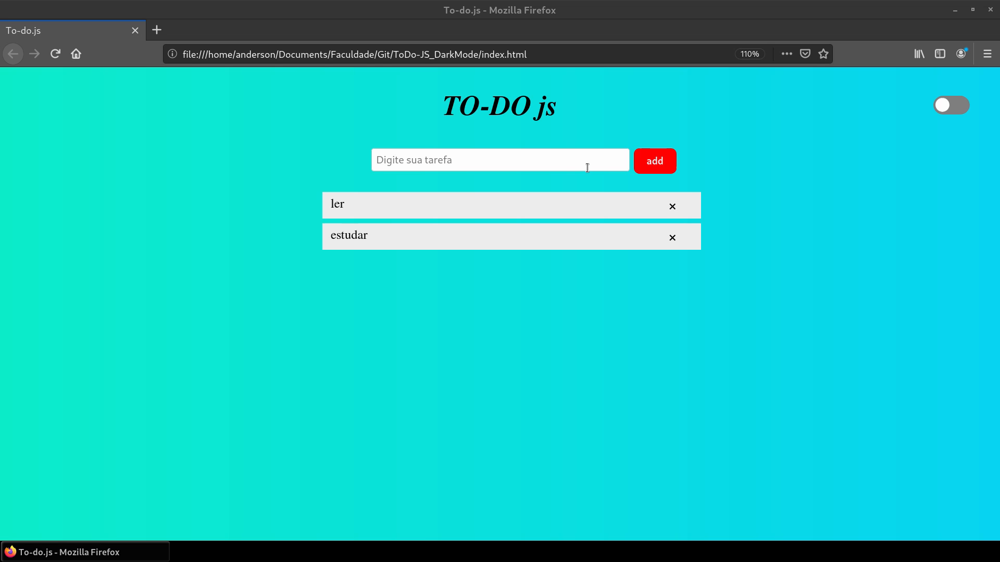
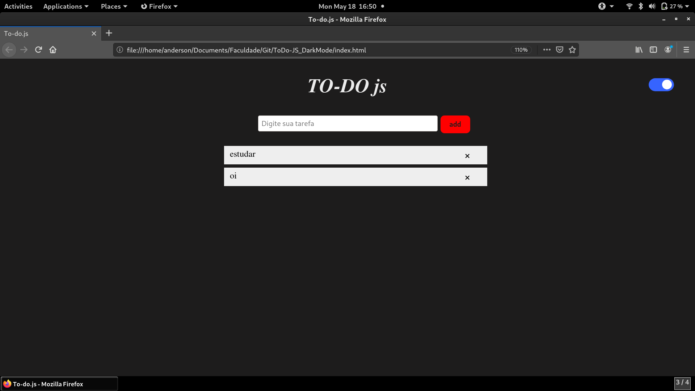

## ToDo/DarkMode - JS

O projeto consiste na criação de to-do (lista de tarefas), com Javascript, Css e html.

Para Rodar o projeto basta abrir o arquivo main.js. As informações salvas no to-do são armazenadas no [localStorage](https://developer.mozilla.org/pt-BR/docs/Web/API/Window/Window.localStorage). É possivel vizualizar as informações no localStorage da sequinte forma:

* Abrir a seção desenvolverdor no navegador (F12);
* Clicar na opção "aplication";
* Acessar "LocalStorage";

## Imagens

## Darkmode

Fonte: https://www.youtube.com/watch?v=BvhYm0BOLvA